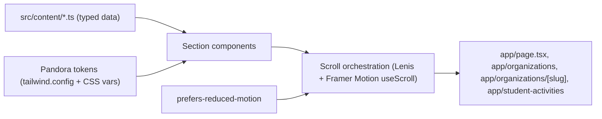

# Architecture

## Stack

- **Framework:** Next.js (App Router), React, TypeScript — statically exported (`output: "export"`), so there is no Node server at runtime and the site deploys to any static host.
- **Styling:** Tailwind CSS, with the Pandora palette and motion tokens defined once in `tailwind.config` and CSS custom properties.
- **Scroll & motion:** Framer Motion (`useScroll`, `useTransform`, `useInView`) for section reveals and parallax; Lenis for smooth scrolling. CSS/SVG for glow effects.
- **Hero:** a single `<canvas>` 2D particle system for woodsprites/spores. No WebGL, no react-three-fiber.
- **Content:** typed TypeScript data modules — no MDX, no CMS, no runtime data fetching.
- **Testing:** Vitest + Testing Library for unit/render tests, Playwright for per-route smoke tests.

## Data Flow

Content is static and known at build time. There is no server, database, or external API call in the browser.

Trace for a program card on `/`:

1. `src/content/programs.ts` exports a typed array of the six programs, each `{ id, abbr, title, description, status }`.
2. `app/page.tsx` maps that array into `ProgramSection` components.
3. Each `ProgramSection` wraps its children in a `Bloom` scroll primitive (`src/lib/motion/`), which uses `useInView` + `useTransform` to animate opacity, glow, and translate.
4. Lenis wraps the root layout; `prefers-reduced-motion` is read once and short-circuits every animation to a static, fully-visible state.
5. The build statically renders everything; the browser receives HTML, CSS, and a small JS bundle.

## Key Modules

- `app/` — App Router routes: `page.tsx` (landing), `organizations/page.tsx`, `organizations/[slug]/page.tsx` (static `generateStaticParams` for each org id), `student-activities/page.tsx`, plus `layout.tsx` (fonts, Lenis provider, skip link, progress vine).
- `src/content/` — typed data: `programs.ts`, `organizations.ts`, `sadu.ts`, `media.ts` (empty photo/director manifests), `accreditations.ts`. Single source the components render. Mirrors `.cursor/CONTENT.md`. Image sets are declared in the manifest, never globbed from `public/` at request time.
- `src/components/scroll/` — reusable scroll primitives: `Bloom`, `Drift`, `Pulse`, `Section`, `ScrollProgressVine`.
- `src/components/pandora/` — themed presentational pieces: `WoodspriteHero` (the one canvas), `GlowFlora`, `VineDivider`, `OrgCard`, `ProgramFlora`, `MantraRoots`.
- `src/lib/motion/` — motion tokens and the `usePrefersReducedMotion` hook; the only place animation physics/easings live.
- `src/lib/` — misc utilities (cn classnames helper).

## Known Constraints

- **Static export only.** No runtime backend, no API routes, no server components that fetch at request time.
- **One canvas instance site-wide.** The woodsprite hero is the only `<canvas>`; particle count is capped and the canvas is disabled entirely when `prefers-reduced-motion` is set, when `devicePixelRatio` is high on a small viewport, or when the tab is hidden. All other glow is CSS/SVG.
- **Performance budget:** LCP < 2.5 s and CLS < 0.1 on mid-tier mobile over 4G (see PRD). Fonts are subset and self-hosted or loaded with `display: swap`; hero canvas is lazy-initialized below the fold.
- **Accessibility floor:** WCAG 2.1 AA. Every animated component must render fully and legibly with motion disabled.
- **No new dependencies** beyond those above without an ADR in `.cursor/DECISIONS.md`.
